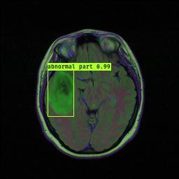
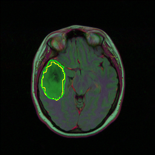

# Brain_MRI_segmenation
This is the project of EECS6895 course, medical image analysis. Done by Yuyang Zhu and Tianle Zhu.

The scripts are about how we trained U-net on the TCGA brain MRI dataset. Run Train——Unet to train the model, Run Save_results to predicted images from test and validation set.

The output also contains images predicted from YOLO trained on the same training set, and predictions on another Brain MRI data which can be found https://www.kaggle.com/loaiabdalslam/brain-tumor-mri-classification-vgg16. We made a comparasion in the presentation slides. The TrainYourOwnYOLO project can be found https://github.com/AntonMu/TrainYourOwnYOLO.

Sample outputs: 

YOLO outputs on TCGA data: 

U-net outputs on TCGA data: 

Still learning on Tensorflow and keras...
